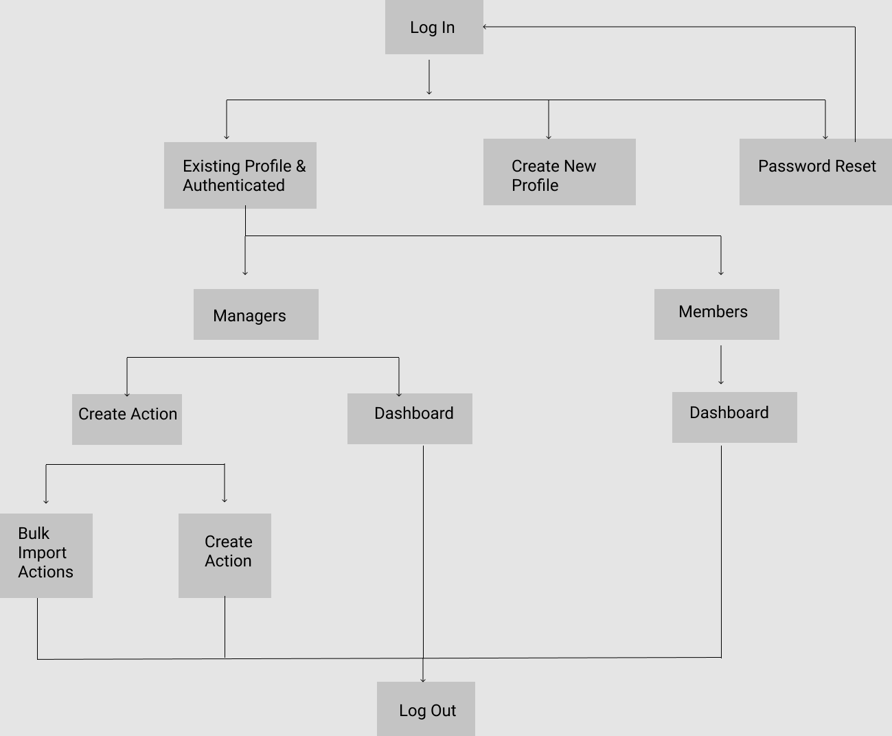

# 1. Action App

**App deployed at: https://hidden-mesa.web.app/**

Disclaimer: The prototype is meant to serve as a mock-up on a desktop screen. Features, database and display responsiveness were *not* implemented.

**Tech Stack**: ReactJS (bootstrapped via create-react-app), Redux, React-Router-DOM, Bootstrap

# 2. Problem

A company would like to develop a feature to ensure that team members "perform an action" (Confirm I've read a new policy, Confirm I've changed the expired password for security, etc.). An idea is suggested: Build an app to require the selected team members/departments/whole company to confirm perform an action (I did it):

- There should be a place for creating the "Action" and select the team members/departments/whole company to perform it.
- There should be a place for member to confirm he/she performed the required Action.
- In the Report Dashboard, show the status of how the "Action" has been performed? Who did or did not? etc. (Need more insights from you)

# 3. Solution
The **WHODUNIT** app is to answer these questions. Its goals are:

- Managers create, assign and track actions
- Team members receive, confirm status and track actions

# 4. User Journey

**Manager**

- Signs into their profile if existing; otherwise creates one; option for credential reset
- Landing page is Dashboard
- Has access to "Create Action"

**Team Member**

- Signs into their profile if existing; otherwise creates one; option for credential reset
- Landing and only page is Dashboard
 
# 5. Sitemap 

# 6. Main Features

## 6.1. Dashboard

**Managers**
- All actions assigned by themselves
- Assignees
- Status
- Sort, filter, pagination

**Team Members**
- All actions assigned to themselves
- Assigners
- Status and Submission of statuses: 
  - 2 values (confirmed / not confirmed), color-coded
  - More than 2 values (confirmed / in progress / completed), color-coded
- Sort, filter, pagination

## 6.2. Create Action

**Create Form**
  - Action
  - Priority level
  - Assign to multiple assignees
    - Team Members
    - Departments ("Product", "HR", etc.)
    - Whole company is "All"
  - Additional Notes
  - Notify assignees

**Form Validation**
- Action is required
- Assignee is required
- Default priority value is null

**Bulk Creation**
  - Allow for imports. Accepted file types: .csv.

## 6.3. Search

Search for employee names (managers/members), departments, action content

## 6.4. User Profile

Basic profile management: creation of profiles, authentication and credential reset

# 7. Technical Specifications 
* Definitions  
  - Action is one-liners (short text)  
  - User is an employee, either a manager or team member
* Internal use
* Single Page Web Application, static with minimal user interaction
* Minimal database with two tables: users, actions 
* Basic user authentication
  
# 8. Ideas

1. Notification:
   - Managers: new completions
   - Members: new assigned actions
   - Reminder to Members
2. Rich Action
   - Title, content, file attachment
   - Action collaborators
   - Different types and statuses of Action
3. Enhanced Dashboard table/report:
   - Compile reports using basic statistical queries, for e.g.: # of confirmed vs. not confirmed 
4. Date Tracking (deadline, timestamps on creation/status updates)

Development depends on direct feedback and usage of team members and managers.

# 9. References

Dashboard Design Inspiration: https://getbootstrap.com/docs/4.5/examples/dashboard/