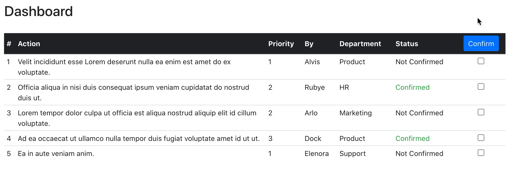

# 1. Action App

**App deployed at: https://hidden-mesa-35540.herokuapp.com/**

Disclaimer: The prototype is meant to serve as a mock-up on a desktop screen. Back-end functions and display responsiveness were *not* implemented.

**Tech Stack**: ReactJS (via create-react-app), React-Router-DOM, Bootstrap (via ReactStrap), React-Table

# 2. Background

A company would like to develop a feature to ensure that team members "perform an action" (Confirm I've read a new policy, Confirm I've changed the expired password for security, etc.). An idea is suggested: Build an app to require the selected team members/departments/whole company to confirm perform an action (I did it):

- There should be a place for creating the "Action" and select the team members/departments/whole company to perform it.
- There should be a place for member to confirm he/she performed the required Action.
- In the Report Dashboard, show the status of how the "Action" has been performed? Who did or did not? etc. (Need more insights from you)

# 3. Specifications 
- Definitions  
: Action is one-liners  
: User is an employee, either a manager or team member
- Goals:
  - Managers create, assign and track actions
  - Team members receive, confirm status and track actions

* Internal use
* Single Page Web Application, static with minimal user interaction
* Minimal database with two tables: users, actions 
* Basic user authentication

# 4. Sitemap 
Refer to sitemap.png

# 5. User Journey

**Manager**

- Signs into their profile if existing; otherwise creates one; option for credential reset
- Landing page is Dashboard
- Has access to "Create Action"

**Team Member**

- Signs into their profile if existing; otherwise creates one; option for credential reset
- Landing and only page is Dashboard

# 6. Main Features

## 6.1. Dashboard

**Managers**
- All actions assigned by themselves, sorted by priority
- Assignees
- Status
- Sortable

**Team Members**
- All actions assigned by managers, sorted by priority
- Assigners
- Status and Submission / Updating of statuses: two versions:
  - 1.0: 2 values (confirmed / not confirmed), color-coded
  - 1.1: more than 2 values (confirmed / in progress / completed), color-coded
- Sortable

**Both**
- Pagination

## 6.2. Create Action

Create Form
  - Action
  - Priority level
  - Assign to multiple assignees
    - Team Members
    - Departments ("Product", "HR", etc.)
    - Whole company is "All"
  - Additional Notes
  - Notify

Form Validation
- Action is required
- Assignee is required
- Default priority value is null

Bulk Creation
  - Allow for imports. Accepted file types: .csv.

Created actions are populated into database, which then will update the app's state and dashboard.

## 6.3 Search

  Search for employee names (managers/members), departments, action content

## 6.4 User Profile

Basic profile management: creation of profiles, authentication and credential reset
  
# 7. Potential Expansion

1. Notification:
   - Managers: new completions
   - Members: new assigned actions
   - Reminder to Members
2. Rich Action
   1. Title, content, file attachment
   2. Action collaborators
   3. Different types and statuses of Action
3. Enhanced Dashboard table/report:
   1. Sort/filter
   2. Compile basic reports using basic statiscal queries, for e.g.: # of confirmed vs. not confirmed 
4. Date Tracking (deadline, timestamps on creation/status updates)

These are ideas for brainstorming. Development depends on direct feedback and usage of team members and managers.

# 8. References

Dashboard Design Inspiration: https://getbootstrap.com/docs/4.5/examples/dashboard/